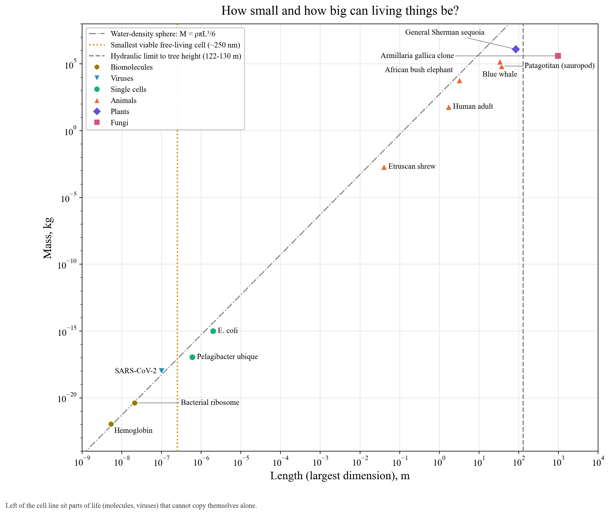

# How small and how big can living things be?

Life sits far from every physical hard bound, so this chart has no red or blue zones. What limits living things are engineering problems.

**Practical limits.**
- **Smallest free-living cell (~250 nm, dotted amber).** A National Research Council workshop estimated that a cell needs roughly 250–300 nm to hold a minimal genome, ribosomes and the machinery to copy itself. Pelagibacter ubique, among the smallest cells known, sits just to the right of the line. Ribosomes, proteins and viruses sit to the left: they are parts of life that cannot reproduce on their own.
- **Tallest possible tree (122–130 m, dashed grey).** Water has to be pulled up a column under tension against gravity. Koch et al. (2004) found leaf water stress makes height unsustainable past about 122–130 m. Hyperion, the tallest tree measured, is 116 m. General Sherman, plotted here, is the largest by volume.
- **Water-density sphere (dash-dot).** Compact things (proteins, cells, shrews, humans) sit near this line. Long, thin things (trees, fungal networks) sit well below it.

**Objects.** Hemoglobin, the bacterial ribosome, SARS-CoV-2, Pelagibacter, E. coli, the Etruscan shrew (2 g, the lightest mammal), humans, the African elephant, Patagotitan, the blue whale (the heaviest animal ever), General Sherman and an Armillaria fungus spread over 75 hectares.
