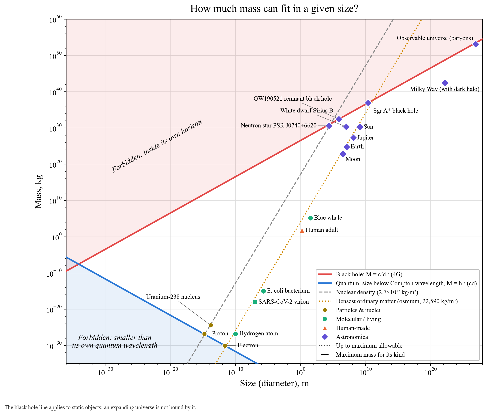

# How much mass can fit in a given size?

**Hard bounds.** Squeeze enough mass into a small enough space and it becomes a black hole. An object of diameter *d* can hold at most M = c²d/(4G) before its own horizon swallows it (red). The Sun would have to shrink to 5.9 km to reach this line.

Quantum mechanics bounds the other side. Nothing can be localised more tightly than its own Compton wavelength h/(Mc), so a light object needs room: M ≥ h/(cd) (blue). The electron, plotted at its Compton wavelength, sits on this line.

The two lines cross near the Planck length (about 10⁻³⁴ m) at roughly the Planck mass (about 20 µg). Physics as we know it has nothing to say beyond that corner.

**Practical limits.** Ordinary matter can't get much denser than osmium (dotted amber). Matter between that line and nuclear density (dashed grey) has to be crushed: white dwarfs and neutron stars live there. Atomic nuclei and protons sit on the nuclear-density line. A neutron star sits about halfway, in log terms, between nuclear density and the black hole line.

**Objects.** Sgr A* sits exactly on the black hole line, as it must. The cap above Sirius B is the Chandrasekhar mass (1.4 M☉), the largest a white dwarf can be. The cap above PSR J0740+6620 is the largest a neutron star can be.

**A caveat.** The observable universe is plotted using ordinary (baryonic) matter only. Counting all of its mass-energy would put it above the black hole line. That is not a contradiction: the Schwarzschild bound applies to static objects, and the universe is expanding.
