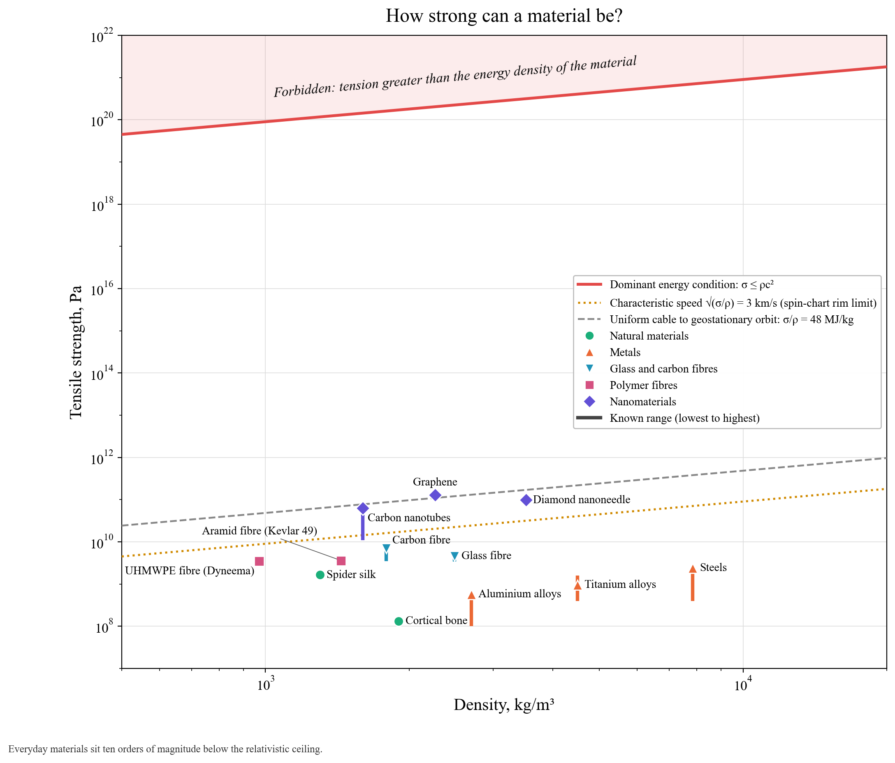

# How strong can a material be?

This is an Ashby-style chart (strength against density) with one extra line from relativity.

**Hard bound (red).** The dominant energy condition of general relativity says a material's tension cannot exceed its energy density: σ ≤ ρc². Above that, sound in the material would travel faster than light. Everyday materials sit about ten orders of magnitude below it. There is a lot of room, and chemistry can't reach it.

**Practical limits.**
- **√(σ/ρ) = 3 km/s (dotted amber).** This is the same rim speed that limits spinning objects on the spin chart. The best bulk engineering materials stop near it. Graphene, with an intrinsic strength of 130 GPa, is above it.
- **Space elevator (dashed grey).** A uniform cable hanging from geostationary orbit to the equator needs specific strength GM(1/R − 1/R_geo) − ω²(R_geo² − R²)/2 ≈ 48 MJ/kg. That is a breaking length of about 4,900 km at 1 g. Only defect-free graphene clears the line, and it does so only as a single atomic sheet. Real carbon nanotubes fall just short, and real cables are weakened by defects.

**Objects.** Bone, spider silk, aluminium, titanium and steel (bars from ordinary to best alloys), glass, aramid, UHMWPE and carbon fibres, carbon nanotubes, diamond nanoneedles and graphene.
