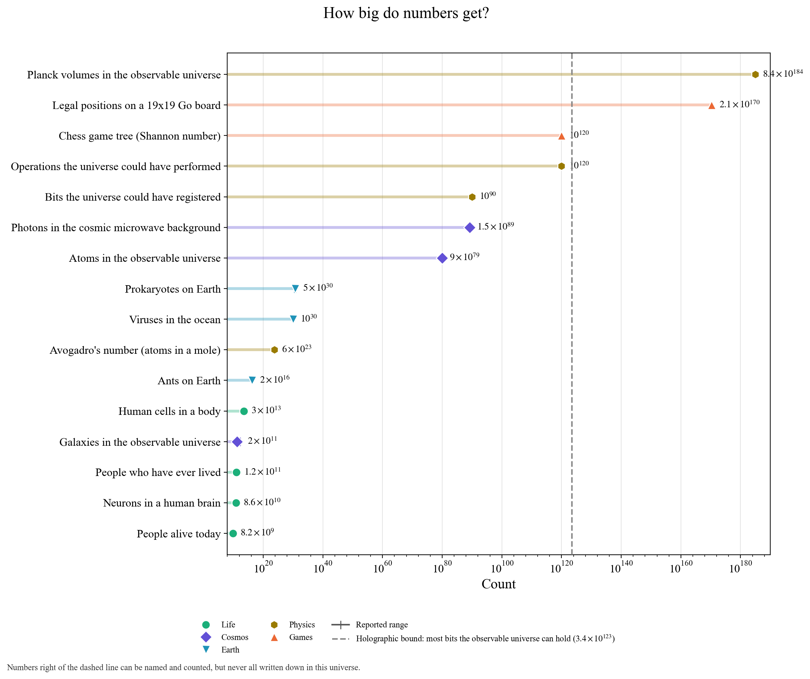

# How big do numbers get?

Counting things in the real world quickly runs into big numbers:
- About 8 billion people alive.
- 30 trillion cells in a body.
- 20 quadrillion ants.
- 10³⁰ viruses in the sea.
- About 10⁸⁰ atoms in the observable universe.

**The holographic bound (dashed).** The most information a region can hold is set by its surface area in Planck units, not its volume. For the observable universe that is about 3×10¹²³ bits. Lloyd (2002) estimated the universe has performed at most 10¹²⁰ operations since the Big Bang.

Some numbers lie beyond the dashed line:
- The 2×10¹⁷⁰ legal positions of a Go board.
- The 10¹⁸⁵ Planck volumes in the observable universe.

These can be named and even counted exactly, but there is not enough room in the universe to write them all down, one by one.
