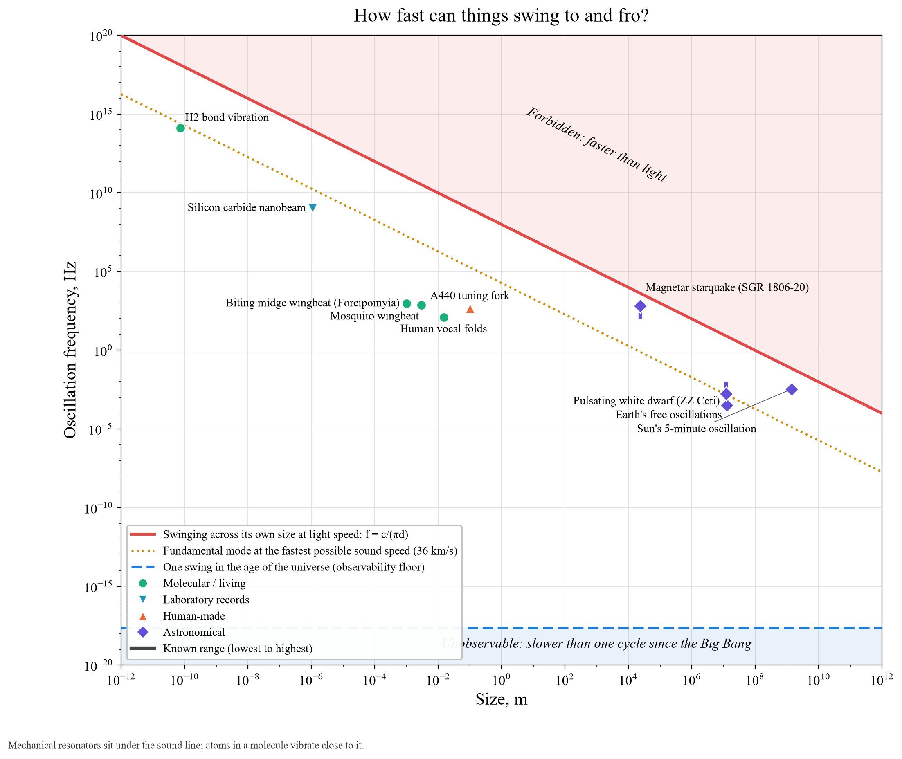

# How fast can things swing to and fro?

This chart covers oscillation: motion back and forth through a central point, rather than rotation.

**Hard bound.** Something swinging across its own size d at frequency f reaches a peak speed near πfd. That must stay below c, so f < c/(πd) (red), the same bound as for spin.

**Practical limit.** The fundamental mode of a solid object is f = v/(2d), where v is its speed of sound. Trachenko et al. (2020) showed that sound in any solid or liquid is slower than about 36 km/s, a limit set by fundamental constants (dotted amber). The hydrogen molecule's bond vibration, 125 trillion times a second, sits right near this line. Molecules ring as fast as matter allows.

**Observability floor (blue, dashed).** One swing in 13.8 billion years.

**Objects.** A gigahertz nanobeam, a biting midge's wings (800–950 Hz, the fastest wingbeat measured), a mosquito's wings (717 Hz), human vocal folds (120–210 Hz while speaking), a 440 Hz tuning fork, a magnetar's crust ringing at 626 Hz after a giant flare, pulsating white dwarfs (periods of 100–1500 s), the Earth ringing for weeks after the 2004 Sumatra earthquake, and the Sun's 5-minute surface oscillations.
