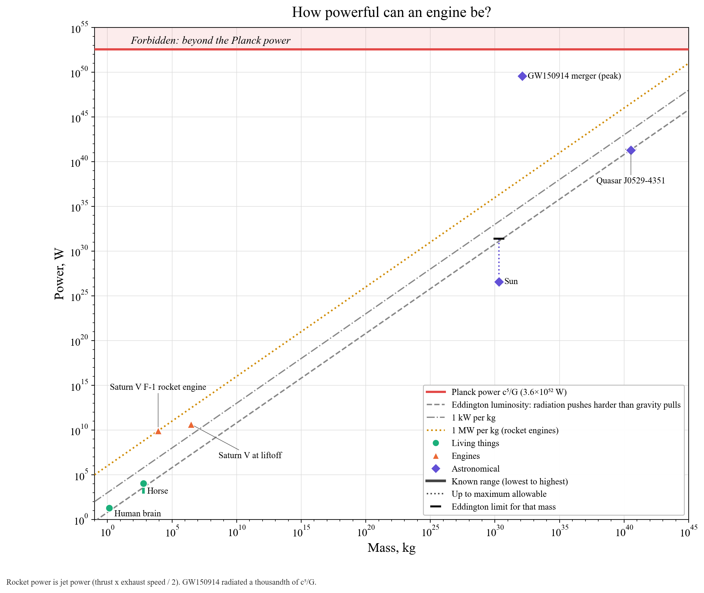

# How powerful can an engine be?

**Hard bound.** The Planck power c⁵/G ≈ 3.6×10⁵² W is the most power any system can put out (red). Merging black holes come closest: GW150914 peaked at 3.6×10⁴⁹ W in gravitational waves, a thousandth of the bound and more than all the stars in the observable universe combined.

**Practical limit.** For anything that shines by accretion or fusion, the Eddington luminosity (dashed grey) is where radiation pressure on the gas outweighs gravity. The brightest known quasar, J0529-4351, sits right at it. The Sun runs about 100,000 times below its own limit (black cap).

**Reference lines.** 1 kW/kg is typical of animals and engines. 1 MW/kg is reached only by rocket engines: a Saturn V F-1 engine put out about 9 GW of jet power from 8.4 tonnes.
