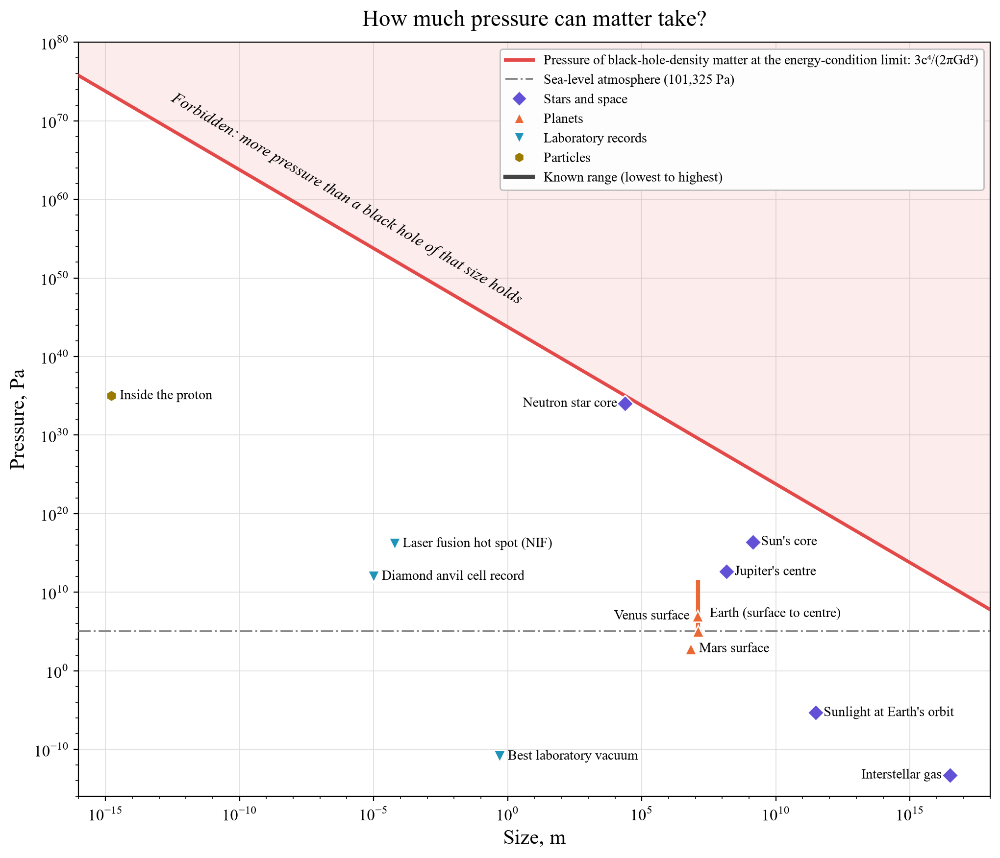

# How much pressure can matter take?

**Hard bound.** Pressure is an energy density, so the dominant energy condition caps it at ρc². At black-hole density for a region of size d, that is 3c⁴/(2πGd²) (red). Larger regions can hold less pressure.

**Objects.**
- Interstellar gas: 5×10⁻¹⁴ Pa.
- The best laboratory vacuum: about 10⁻¹¹ Pa (10⁻¹³ Torr).
- Sunlight pressing on an absorber at Earth's orbit: 4.5 µPa.
- The surfaces of Mars, Earth and Venus: 636 Pa, 1 atm and 92 atm.
- The centre of the Earth: 364 GPa.
- A diamond anvil cell: above 1 TPa in the lab.
- Jupiter's centre: about 4 TPa.
- A laser-fusion hot spot at the National Ignition Facility: about 150 Gbar (1.5×10¹⁶ Pa), close to the Sun's core but in a speck tens of microns across.
- The Sun's core: 2.5×10¹⁶ Pa.
- A neutron star's core: around 10³⁴ Pa. This is within a factor of a few of the black-hole bound for its size, which is why heavier neutron stars collapse.
- The inside of a proton: about 10³⁵ Pa (Burkert et al. 2018), measured from how quarks scatter electrons. That is higher than in the core of a neutron star.
