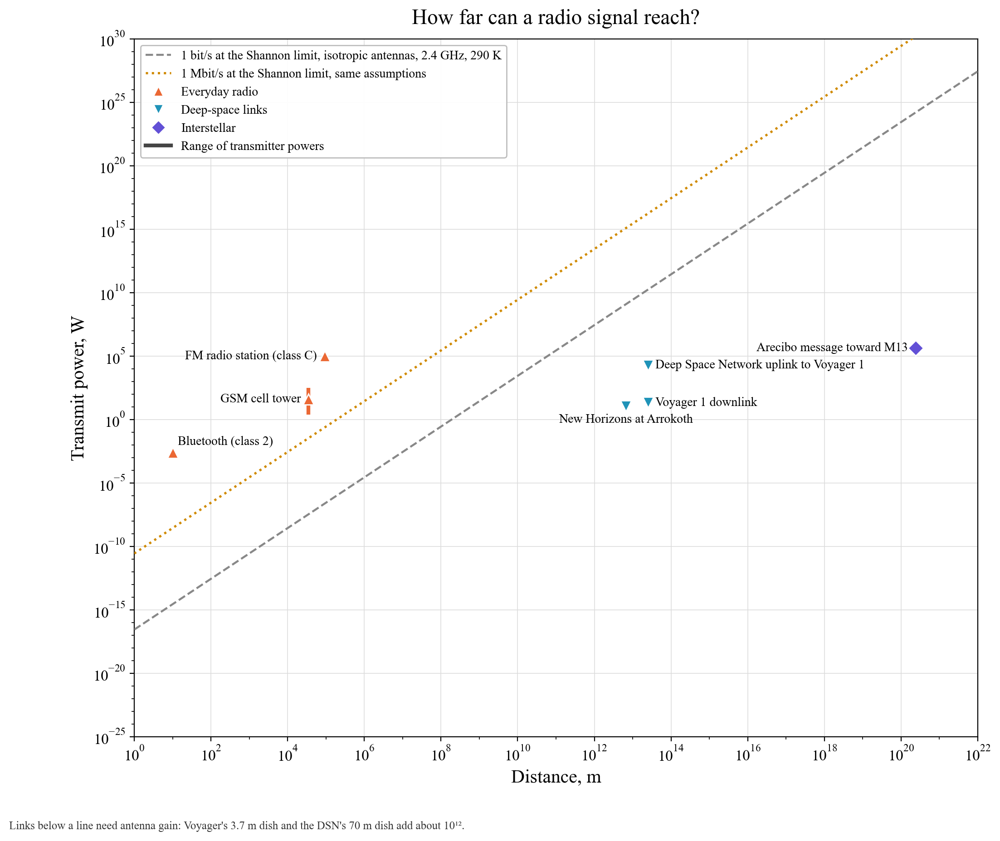

# How far can a radio signal reach?

Every receiver hears thermal noise. Shannon showed that each bit needs at least k_BT ln 2 of received energy. Between two simple (isotropic) antennas, the transmitted power spreads out as (4πr/λ)².

**The lines** show the minimum transmit power for 1 bit/s (dashed grey) and 1 Mbit/s (dotted amber) at 2.4 GHz, with isotropic antennas and 290 K noise.
- Everyday radio (Bluetooth, cell towers, FM) sits far above them and wastes power generously.
- Deep-space links sit *below* the 1 bit/s line. Voyager 1 sends 160 bit/s with 22 W from 25 billion km. It only works because its 3.7 m dish and NASA's 70 m dishes add about a trillion times of antenna gain, and the receivers are cooled to about 20 K.

The 1974 Arecibo message was sent with 450 kW toward the star cluster M13. It will arrive in about 25,000 years.
