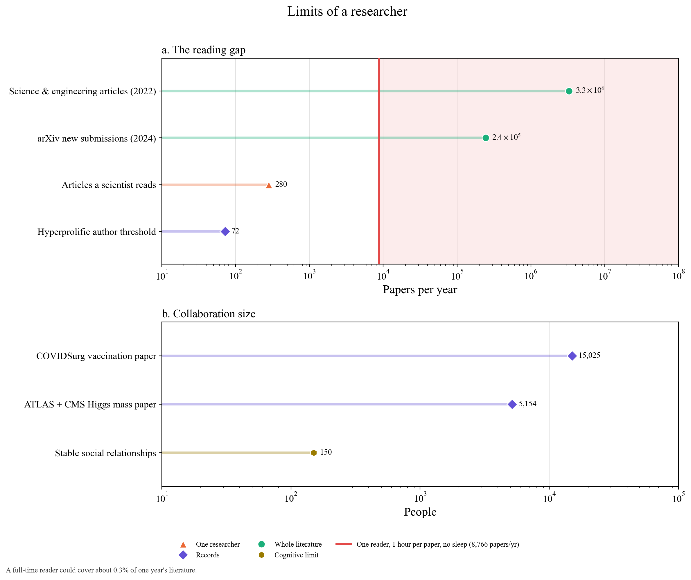

# Limits of a researcher

## a. The reading gap

A year has 8,766 hours. At one hour per paper, with no sleep, one person could read at most 8,766 papers a year (red). In practice US faculty read about 280 articles a year (Tenopir et al. 2009). Researchers who publish more than 72 papers a year, one every five days, are rare enough to be called "hyperprolific" (Ioannidis et al. 2018).

Meanwhile arXiv received about 244,000 new submissions in 2024, and Scopus indexed 3.3 million science and engineering articles in 2022. A reader working non-stop could cover about 0.3% of one year's output. Reading everything is physically impossible, not just impractical.

## b. Collaboration size

Dunbar's number (about 150 stable relationships) is a rough cognitive limit on how many people one person can really know. Physics and medicine routinely pass it: the combined ATLAS + CMS Higgs mass paper has 5,154 authors, and a 2021 COVIDSurg study has 15,025. Collaborations that size run on institutions, not on personal acquaintance.
