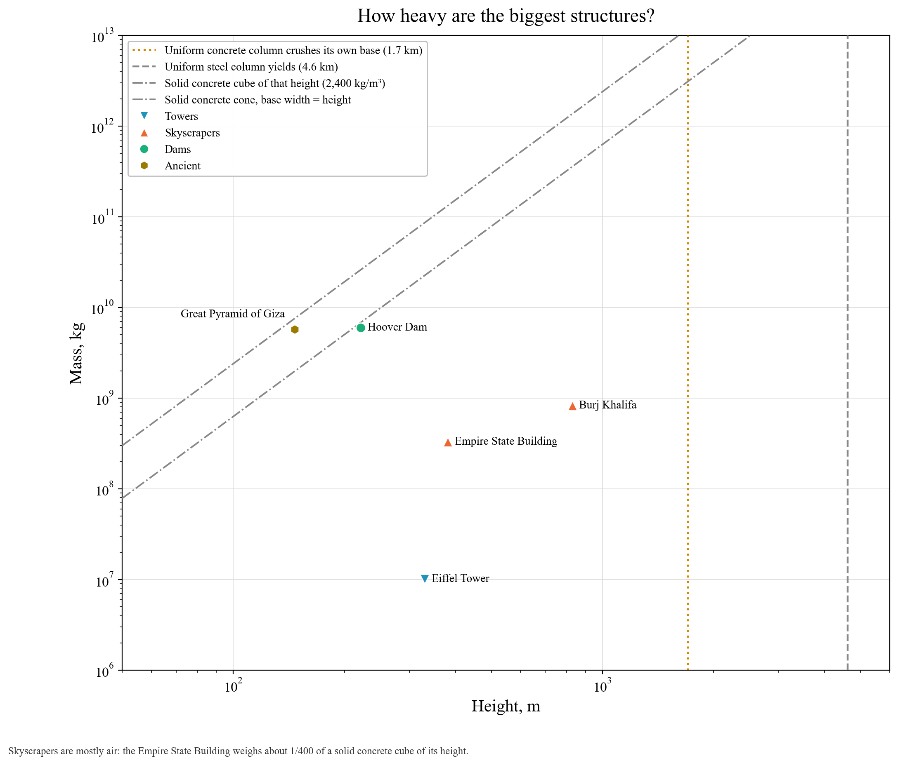

# How heavy are the biggest structures?

**Reference lines.** A solid concrete cube as tall as the structure (dotted amber), and a solid cone with base width equal to height (dash-dot). Massive ancient and civil works sit near them:
- The Great Pyramid (5.75 million t) is close to a solid cone.
- The Hoover Dam (6 million t) is close to the same lines.

Towers and skyscrapers are mostly air. The Eiffel Tower weighs only 10,100 t. The Empire State Building weighs about 1/400 of a solid concrete cube of its height.

**Vertical lines.** The heights at which a uniform concrete (1.7 km) or steel (4.6 km) column would crush its own base. See the buildings chart for those limits.

The Burj Khalifa value counts only its concrete and steel reinforcement, so it is a lower bound.
