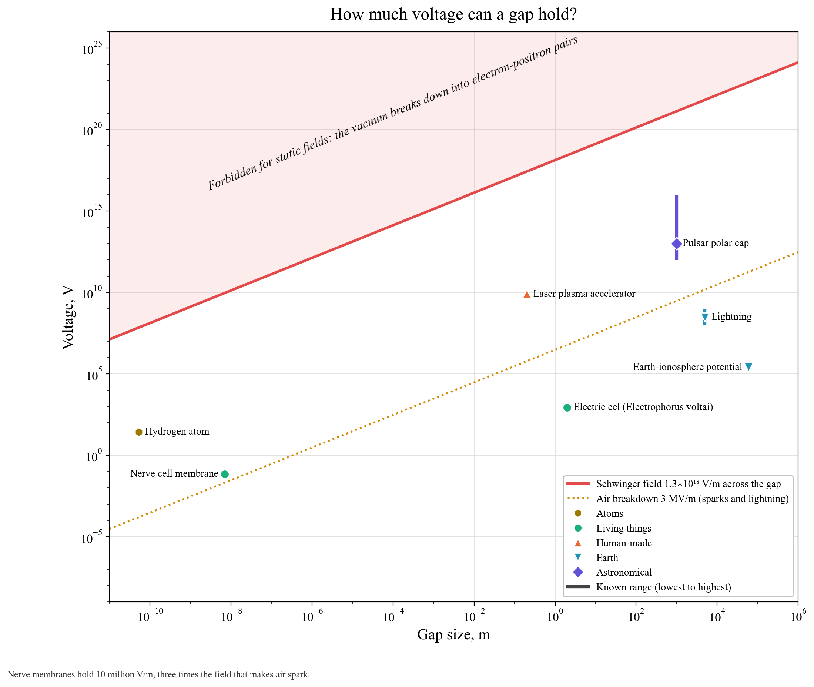

# How much voltage can a gap hold?

**Bound for static fields.** Above the Schwinger field (1.3×10¹⁸ V/m), empty space breaks down into electron-positron pairs. No static field can be sustained beyond it (red).

**Practical limit.** Air sparks at about 3 MV/m (dotted amber), which sets the length of a lightning bolt or a spark.

**Objects.**
- **Nerve cell membrane:** 70 mV across 7 nm, about 10 million V/m, three times the field that makes air spark.
- **Hydrogen atom:** the electron sits in 5×10¹¹ V/m.
- **Electric eel:** delivers 860 V across a two-metre body.
- **Lightning:** hundreds of megavolts over kilometres.
- **Global atmospheric circuit:** keeps the ionosphere about 250 kV above the ground.
- **Laser-plasma accelerator:** gains 8 GeV in 20 cm.
- **Pulsar polar caps:** reach 10¹²–10¹⁶ V, enough to tear particles off the star.
